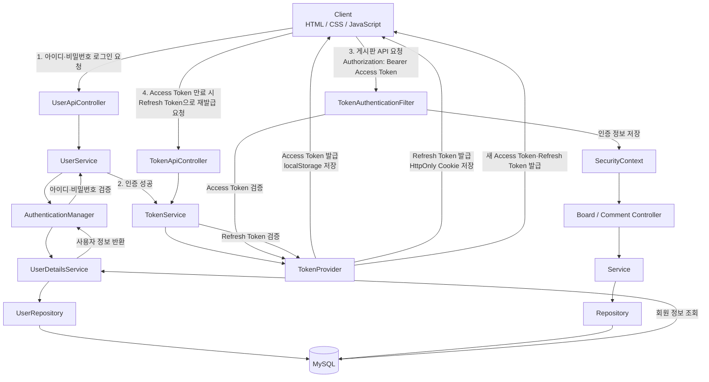

## 시스템 아키텍처

사용자가 아이디와 비밀번호를 입력하면 `AuthenticationManager`가 회원 정보를 조회하고 비밀번호를 검증한다. 인증에 성공하면 `TokenProvider`가 Access Token과 Refresh Token을 생성한다.

Access Token은 브라우저의 `localStorage`에 저장하고, Refresh Token은 HttpOnly 쿠키에 저장한다. 이후 게시판 API 요청에는 Access Token을 `Authorization` 헤더에 포함하여 전송한다.

`TokenAuthenticationFilter`는 전달받은 Access Token을 검증한다. 토큰이 유효하면 로그인 사용자 정보를 `SecurityContext`에 저장하고, 컨트롤러에서는 해당 사용자 정보를 이용하여 게시글과 댓글의 작성자를 처리한다.

게시글 작성, 수정, 삭제 및 댓글 작성 요청은 Controller → Service → Repository 순서로 처리되며, 게시글 수정과 삭제는 로그인 사용자와 게시글 작성자가 같은 경우에만 가능하다.

Access Token이 만료되면 Refresh Token을 이용하여 토큰 재발급 API를 호출하고, Refresh Token이 유효한 경우 새로운 Access Token과 Refresh Token을 발급한다.
