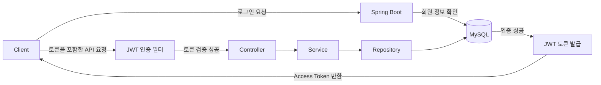

## 시스템 아키텍처

```mermaid
flowchart LR
    A[Client] -->|로그인 요청| B[Spring Boot]
    B -->|회원 정보 확인| C[(MySQL)]
    C -->|인증 성공| D[JWT 토큰 발급]
    D -->|Access Token 반환| A

    A -->|토큰을 포함한 API 요청| E[JWT 인증 필터]
    E -->|토큰 검증 성공| F[Controller]
    F --> G[Service]
    G --> H[Repository]
    H --> C
```

사용자가 로그인을 요청하면 서버에서 회원 정보를 확인하고, 인증에 성공하면 JWT 토큰을 발급한다.

이후 게시글이나 댓글 API를 요청할 때 Access Token을 함께 전송한다. 서버는 JWT 인증 필터에서 토큰을 확인한 후 Controller, Service, Repository를 거쳐 데이터를 조회하거나 저장한다.
